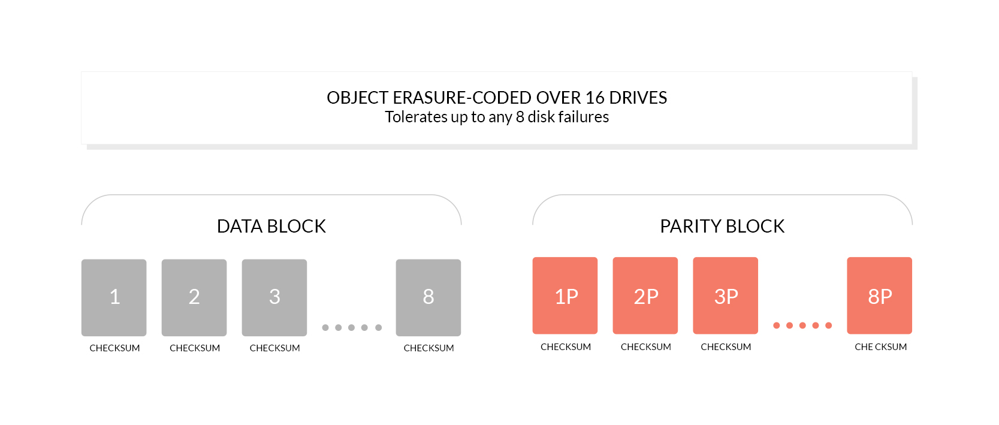
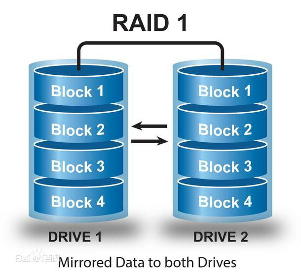

**minio教程**
[TOC]

# 1. 简介

Minio 是一个基于Apache License v2.0开源协议的对象存储服务。它兼容亚马逊S3云存储服务S3接口，非常适合于存储大容量非结构化的数据，例如图片、视频、日志文件、备份数据和容器/虚拟机镜像等，而一个对象文件可以是任意大小，从几kb到最大5T不等。

# 2. 运行环境

可以在Linux，Docker，macOS，Windows环境

# 3. 存储方式

Minio采用对象存储的方式来存储文件。

块存储、文件存储、对象存储这三者的本质差别是什么？
本质是一样的，底层都是块存储，只是在对外接口上表现不一致，分别应用于不同的业务场景。
分布式存储的应用场景相对于其存储接口，现在流行分为三种:

【块存储】
块存储接口的操作对象是二进制数据，物理存储位置是硬盘 （通过逻辑目录 找到对应分区，然后找到对应存储块存储）。这种接口通常以QEMU Driver或者Kernel Module的方式存在，这种接口需要实现Linux的Block Device的接口或者QEMU提供的Block Driver接口，如Sheepdog，AWS的EBS，青云的云硬盘和阿里云的盘古系统，还有Ceph的RBD（RBD是Ceph面向块存储的接口）
典型设备：磁盘阵列，硬盘，虚拟硬盘

【文件存储】
文件存储接口操作对象是目录和文件，物理存储位置 是由 文件服务器对应的文件系统来决定的（比块存储多一个过程:判断参数文件 应该存储到哪个逻辑目录上。）
典型设备：FTP、NFS服务器，SamBa、Ceph

【对象存储】
对象存储接口：通常意义的键值存储，其接口就是简单的GET、PUT、DEL和其他扩展，如七牛、又拍、Swift、S3。操作对象是对象。
如果是对象是文件，底层还是使用文件服务器存储（判断参数文件 应该存储到哪个逻辑目录上），

典型设备：内置大容量硬盘的分布式服务器，如Minio、Ceph（S3接口）

# 4. 文件高可用保证措施

Minio使用纠删码erasure code和校验和checksum来保护数据免受硬件故障和无声数据损坏。 即便丢失一半数量（N/2）的硬盘，仍然可以恢复数据。

## 4.1. 什么是纠删码

纠删码是一种恢复丢失和损坏数据的数学算法， Minio采用Reed-Solomon code将对象拆分成N/2数据和N/2 奇偶校验块。 这就意味着如果是12块盘，一个对象会被分成6个数据块、6个奇偶校验块，你可以丢失任意6块盘（不管其是存放的数据块还是奇偶校验块），仍可以从剩下的盘中的数据进行恢复。

纠删码的工作原理和RAID或者复制不同，像RAID6可以在损失两块盘的情况下不丢数据，而Minio纠删码可以在丢失一半的盘的情况下，仍可以保证数据安全。 而且Minio纠删码是作用在对象级别，可以一次恢复一个对象，而RAID是作用在卷级别，数据恢复时间很长。 Minio对每个对象单独编码，存储服务一经部署，通常情况下是不需要更换硬盘或者修复。Minio纠删码的设计目标是为了性能和尽可能的使用硬件加速。

* 纠删码存储



* RAID存储



# 5. 安装

## 5.1. 下载minio

```shell
chmod 777 /opt
mkdir /opt/minio && cd /opt/minio
wget https://dl.minio.io/server/minio/release/linux-amd64/minio
chmod +x minio
```

## 5.2. 保存AccessKey和SecretKey

```shell
./minio server /opt/minio/data
> Endpoint:  http://192.168.192.132:9000  http://172.17.0.1:9000  http://127.0.0.1:9000
> AccessKey: HE8CZFMGJZC398QWFRD8
> SecretKey: 6+Zs0HGoYyxJmDOxbL+eXZaLxZ3kUvb+cQs0hVqt
```

将AccessKey和SecretKey保存到key文件中

```shell
cat >> key <<EOF
AccessKey: HE8CZFMGJZC398QWFRD8
SecretKey: 6+Zs0HGoYyxJmDOxbL+eXZaLxZ3kUvb+cQs0hVqt
EOF
```

保存好之后输入```Ctrl+C```将前台运行的程序停掉

## 5.3. 单节点启动minio
使用Erasure code 运行minio server 保证磁盘文件高可用。

```shell
nohup ./minio server data1 data2 data3 data4 data5 data6 data7 data8 data9 data10 data11 data12 >> minio.log 2>&1 &
```

## 5.4. 集群部署

```shell
cd ~
cat >> .conf <<EOF
export MINIO_ACCESS_KEY={自定义AccessKey，最小长度3字符}
export MINIO_SECRET_KEY={自定义SecretKey，最小长度8字符}
EOF
source .bashrc
cd /opt/minio
nohup ./minio server http://{ip1}/opt/minio/export1 http://{ip1}/opt/minio/export2 \
               http://{ip2/opt/minio/export1 http://{ip2}/opt/minio/export2 \
               http://{ip3}/opt/minio/export1 http://{ip3}/opt/minio/export2 \
               http://{ip4}/opt/minio/export1 http://{ip4}/opt/minio/export2 >> minio.log 2>&1 &
```

## 5.5. 登录web页面创建bucket

浏览器输入 http://{minioIp}:9000
新建一个bucket 名为activity 

## 5.6. 配置无账户登录下文件访问权限
这种权限通常只提供读取权限，供前端访问

web页面点击左侧桶名称上的Edit Policy，将访问规则配置为
> prefix=?*    policy=ReadOnly

prefix配置含义：可以访问http://{minioIp}:9000/activity/路径下至少包含一个字母的文件,如

> http://{minioIp}:9000/activity/  不可访问
> http://{minioIp}:9000/activity/a 有名为a的文件的话可以访问
> http://{minioIp}:9000/activity/xxx.txt 有名为xxx.txt的文件的话可以访问

## 5.7. 配置有账户登录下文件权限

这种权限通常供管理员或后端程序做文件写入或读取使用

### 5.7.1. 下载mc客户端

```shell
cd /opt/minio
wget https://dl.minio.io/client/mc/release/linux-amd64/mc
chmod +x mc
./mc -help
```

### 5.7.2. 配置mc的访问token

```shell
vim ~/.mc/config.json
```

填写url为http://localhost:9000一项的accessKey和secretKey，如

```json
...
"local": {
    "url": "http://localhost:9000",
    "accessKey": "0PW11BMC1U61L4I36J5I",
    "secretKey": "z5khXN+724is841X7PAIg32Kwk6w3+FRJPW4oWyl",
    "api": "S3v4",
    "lookup": "auto"
}
...
```

### 5.7.3. 新建并编辑配置文件/opt/minio/config.json

```json
{
    "Version": "2012-10-17",
    "Statement": [
        {
            "Action": ["s3:GetBucketLocation"],
            "Sid": "",
            "Resource": ["arn:aws:s3:::activity",
                        "arn:aws:s3:::ads",
                        "arn:aws:s3:::item"],
            "Effect": "Allow",
            "Principal": {"AWS": "*"}
        },
        {
            "Action": ["s3:ListBucket"],
            "Sid": "",
            "Resource": ["arn:aws:s3:::activity",
                        "arn:aws:s3:::ads",
                        "arn:aws:s3:::item"],
            "Effect": "Allow",
            "Principal": {"AWS": "*"}
        },
        {
            "Action": ["s3:ListBucketMultipartUploads"],
            "Sid": "",
            "Resource": ["arn:aws:s3:::activity",
                        "arn:aws:s3:::ads",
                        "arn:aws:s3:::item"],
            "Effect": "Allow",
            "Principal": {"AWS": "*"}
        },
        {
            "Action": ["s3:ListMultipartUploadParts",
                        "s3:GetObject",
                        "s3:AbortMultipartUpload",
                        "s3:PutObject",
                        "s3:DeleteObject"],
            "Sid": "",
            "Resource": ["arn:aws:s3:::activity/*",
                        "arn:aws:s3:::ads/*",
                        "arn:aws:s3:::item/*"],
            "Effect": "Allow",
            "Principal": {"AWS": "*"}
        }
    ]
}
```

### 5.7.4. 查看集群名称

```shell
./mc config host ls
#获取一下集群的名称，确定为local
> local: http://localhost:9000 0PW11BMC1U61L4I36J5I z5khXN+724is841X7PAIg32Kwk6w3+FRJPW4oWyl  S3v4   auto 
```

### 5.7.5. 添加规则

```shell
./mc admin policy add local/ javapolicy /opt/minio/config.json
```

查看配置好的规则列表

```shell
./mc admin policy list local
```

### 5.7.6. 添加用户

```shell
./mc admin user add local/ yanfa yanfa-2018 javapolicy
```

查看配置好的用户列表

```shell
./mc admin user list local
```

# 6. JavaSdk的使用案例

见demo代码

# 7. 参考文献

https://docs.min.io/
https://github.com/minio/minio
https://blog.csdn.net/xiaoliuliu2050/article/details/79962841